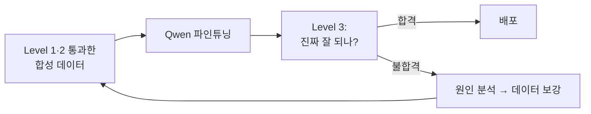
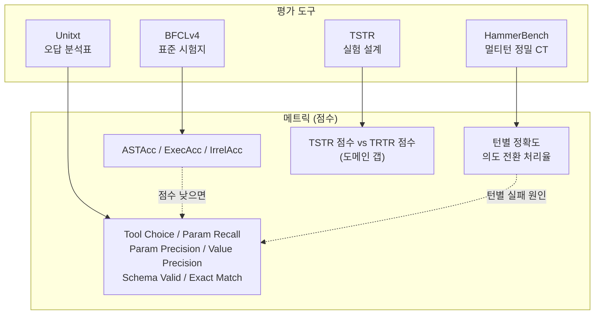

# Level 3: 다운스트림 성능 평가 — 심화 가이드

> **작성일**: 2026-02-18  
> **기반 문서**: [data_validation_report.md](file:///home/cwj/llm-project/docs/data_validation_report.md) §5  
> **목적**: 합성 펑션콜링 데이터로 파인튜닝한 모델의 성능을 "어떻게 평가할 것인가"를 쉽게 정리

---

## 0. 왜 Level 3이 필요한가?

Level 1(구조 검증)·Level 2(LLM 심판)는 **데이터 자체**를 깐깐하게 봅니다.  
Level 3은 그 데이터로 학습시킨 **모델이 진짜로 잘 작동하는지**를 봅니다.

> 아무리 깨끗한 데이터라도, 파인튜닝 결과물이 배달 앱에서 엉뚱한 함수를 부르면 의미가 없습니다.



---

## 1. 평가 도구/벤치마크 4종 + 보너스 1종

Level 3에서 등장하는 이름들은 크게 **4가지 도구 + 보너스 1개**입니다.  
각각 역할이 다르고, 서로 보완 관계입니다.

### 한 문장 요약

| 도구                          | 한 문장 정의                                         |
| ----------------------------- | ---------------------------------------------------- |
| **BFCLv4**                    | 표준 시험지                                          |
| **HammerBench**               | 멀티턴 정밀 CT                                       |
| **Unitxt**                    | 오답 분석표 (원인 분해)                              |
| **TSTR**                      | "합성으로 배워서 실제에 통하나"를 증명하는 실험 설계 |
| **FC-RewardBench** *(보너스)* | 정답 비교 대신 리워드모델로 자동 채점하는 보조 엔진  |

---

### 1-1. BFCLv4 — 표준 시험지

> **Berkeley Function-Calling Leaderboard v4**  
> UC Berkeley Gorilla 프로젝트 | 2025년 7월 공개, 12월 리더보드 업데이트

**역할**: 함수콜링을 **표준화된 문제**로 시험 보고 점수를 매기는 벤치마크입니다.

**무엇을 주는가**: 문제 세트 + 평가 기준(메트릭)을 함께 제공합니다.

**언제 쓰나**: "우리 모델이 평균적으로 어느 수준인지"를 **다른 모델과 한 방에 비교**할 때.

**평가 유형 7가지:**

| 유형                | 뜻                                | 배달 앱 예시                                                        |
| ------------------- | --------------------------------- | ------------------------------------------------------------------- |
| Simple              | 함수 1개, 호출 1번                | "치킨집 찾아줘" → `search_restaurants` 1회                          |
| Multiple            | 여러 함수 후보 중 하나 골라 호출  | "주문 확인해줘" → `get_order_history` vs `get_order_status` 중 선택 |
| Parallel            | 같은 함수를 여러 번 호출          | "피자도 치킨도 찾아봐" → `search_restaurants` 2회                   |
| Parallel Multiple   | 서로 다른 함수를 동시에 여러 번   | "장바구니 추가하고 결제 준비" → `add_to_cart` + `prepare_checkout`  |
| Relevance Detection | 호출하면 안 되는 상황 감지        | "라이더 보험 가입" → 호출 거부                                      |
| Format Sensitivity  | 프롬프트 형식이 바뀌어도 견고한지 | JSON/YAML/자연어 등 형식 변화 테스트                                |
| Agentic Multi-Turn  | 에이전트 멀티턴 대화 전체         | 검색→메뉴→장바구니→결제 전체 흐름                                   |

---

### 1-2. HammerBench — 멀티턴 정밀 CT

> **ACL 2025 Findings 발표**

**역할**: 대화가 여러 턴일 때, **턴별로 어디서 틀리는지** 정밀 분석합니다.

**BFCLv4와의 차이**: BFCL은 "전체적으로 몇 점"이라면, HammerBench는 "3번째 턴에서 파라미터 이름 틀림"처럼 **정밀 진단**.

**언제 쓰나**: "주문 플로우처럼 길게 대화하는데 **자꾸 중간에 망가진다**"를 잡을 때.

**핵심 발견**: LLM 펑션콜링 실패의 **1위 원인 = 파라미터 이름 오류**

**배달 앱 멀티턴 진단 예시:**

| 턴  | 고객 발화                         | 평가 포인트                                                  |
| --- | --------------------------------- | ------------------------------------------------------------ |
| 1   | "어제 시킨 거 다시 시키고 싶어"   | 간접 참조("어제 시킨 거") 이해해서 `get_order_history` 호출? |
| 2   | "응, 근데 2마리로 해줘"           | 의도 유지 + 수량 변경해서 `add_to_cart(quantity=2)` 호출?    |
| 3   | "잠깐 주소 회사 말고 집으로 바꿔" | 의도 전환 감지해서 `get_user_addresses` 호출?                |
| 4   | "응"                              | 이전 컨텍스트(장바구니) 유지하면서 주소만 변경?              |

> [!NOTE]
> **자기 조건화(Self-Conditioning)** 주의: 단일 턴에서 정확도가 높은 모델도, 멀티턴 장기 과제에서는 **초기 턴의 오류가 후속 턴 오류를 연쇄적으로 유발**할 수 있습니다. 배달 앱의 전체 주문 플로우에서 이 현상을 특히 주시해야 합니다.

---

### 1-3. Unitxt — 오답 분석표 (원인 분해)

> **IBM Research 개발 | 오픈소스 평가 프레임워크**

**역할**: "틀렸다"를 **왜 틀렸는지** 분해해주는 점수 체계입니다.

**언제 쓰나**: 개선 방향을 찾을 때. 예를 들어 "함수는 맞추는데 **인자 이름을 자꾸 틀린다**"를 자동으로 파악.

**BFCLv4·HammerBench와의 관계**: BFCL/HammerBench의 점수가 낮을 때, **어디를 고쳐야 올라가는지**를 Unitxt 분해 지표로 진단합니다.

*(메트릭 상세는 아래 §2에서 따로 정리)*

---

### 1-4. TSTR — 실험 설계 철학

> **Train on Synthetic, Test on Real**

**역할**: 합성 데이터로 학습한 모델을 **실제 데이터로 테스트**해서 도메인 갭을 측정합니다.

**언제 쓰나**: "합성 데이터가 **진짜 도움이 되나?**"를 가장 강하게 증명할 때.

**핵심 질문**: "합성으로 배워도 실제에서 통하나?"

**실험 4종 세트:**

| 실험         | 학습 데이터           | 테스트 데이터      | 목적           |
| ------------ | --------------------- | ------------------ | -------------- |
| **Baseline** | 없음 (파인튜닝 안 함) | 실제 골드 테스트셋 | 기준점 (바닥)  |
| **TSTR**     | 합성 데이터           | 실제 골드 테스트셋 | 합성의 효과    |
| **TRTR**     | 실제 데이터           | 실제 골드 테스트셋 | 이론적 최대치  |
| **Mixed**    | 합성 + 실제 혼합      | 실제 골드 테스트셋 | 최적 조합 탐색 |

**결과 해석 가이드:**

| TSTR 점수 | TRTR 점수 | 의미                          | 조치                    |
| --------- | --------- | ----------------------------- | ----------------------- |
| 85%+      | 90%+      | 합성이 실제에 근접 ✅          | 파이프라인 유지         |
| 60~75%    | 90%+      | 도메인 갭 존재 ⚠️              | 실제 데이터 혼합 비율 ↑ |
| 50~60%    | 65~75%    | 전반적 데이터 부족            | 데이터 양 확대          |
| 85%+      | 70~80%    | 오히려 합성이 다양해서 유리 🎯 | Mixed로 최적 비율 탐색  |

*(골드 테스트셋 설계는 아래 §3에서 따로 정리)*

---

---

## 2. 메트릭(점수) 체계 정리

### 2-1. BFCL 3대 핵심 메트릭

"모델이 **전체적으로** 얼마나 잘하나?"를 보는 점수입니다.

| 메트릭                       | 보는 것                                         | 쉽게 말하면                   |
| ---------------------------- | ----------------------------------------------- | ----------------------------- |
| **ASTAcc** (AST 정확도)      | 함수명 + 인자 이름/값이 정답과 구조적으로 일치? | "정답 JSON이랑 똑같이 뱉었나" |
| **ExecAcc** (실행 정확도)    | 실제로 실행해봤더니 결과가 맞나?                | "진짜로 돌려봤더니 되나"      |
| **IrrelAcc** (비관련성 탐지) | 호출하면 안 되는 상황에서 거부했나?             | "툴 남발 안 하나"             |

**배달 앱 적용 예시:**

> 고객: "치킨 맛집 찾아줘"  
> 정답: `search_restaurants(keyword="치킨", sort_by="rating")`

| 모델 출력                                                   | ASTAcc | ExecAcc | 설명                    |
| ----------------------------------------------------------- | ------ | ------- | ----------------------- |
| `search_restaurants(keyword="치킨", sort_by="rating")`      | ✅      | ✅       | 완벽                    |
| `search_restaurants(keyword="chicken", sort_by="distance")` | ❌      | ❌       | 구조는 맞지만 값이 다름 |
| `get_menu_items(restaurant_id="xxx")`                       | ❌      | ❌       | 아예 함수가 잘못됨      |

> 고객: "배달 오토바이 보험 가입하고 싶어요"  
> 정답: 호출 안 함 (`no_call`)

| 모델 출력                            | IrrelAcc | 설명        |
| ------------------------------------ | -------- | ----------- |
| 호출 안 함 (거부 + 안내)             | ✅        | 올바른 거부 |
| `search_restaurants(keyword="보험")` | ❌        | 과잉 호출   |

---

### 2-2. Unitxt 6종 분해 메트릭

"**왜** 틀렸는지"를 쪼개서 보는 점수입니다.  
BFCL이 "몇 점"이라면, Unitxt는 "어디서 감점됐는지" 분석표입니다.

| 메트릭                    | 질문                         | 예시                                                         |
| ------------------------- | ---------------------------- | ------------------------------------------------------------ |
| **Tool Choice**           | 함수 선택이 맞았나?          | `search_restaurants` 불러야 하는데 `get_menu_items` 부름 → ❌ |
| **Param Name Recall**     | 필수 인자를 빠짐없이 넣었나? | `keyword` 필수인데 안 넣음 → ❌                               |
| **Param Name Precision**  | 쓸데없는 인자를 넣지 않았나? | `include_soldout`을 멋대로 추가 → 감점                       |
| **Param Value Precision** | 값이 맞나?                   | `keyword="chicken"` (치킨이어야 함) → ❌                      |
| **Schema Validation**     | 타입이 스키마에 맞나?        | `quantity`가 정수여야 하는데 문자열로 넣음 → ❌               |
| **Exact Match**           | 전부 완벽히 동일한가?        | 위의 모든 항목이 다 ✅일 때만 ✅                               |

**이 6개가 유용한 이유 — 개선 방향을 바로 알 수 있습니다:**

| 증상                                    | Unitxt 진단                 | 처방                                           |
| --------------------------------------- | --------------------------- | ---------------------------------------------- |
| Tool Choice는 높은데 Exact Match는 낮음 | → 파라미터 쪽 문제          | 합성 데이터에서 파라미터 다양성 강화           |
| Param Name Recall이 낮음                | → 필수 인자를 자주 빠뜨림   | 프롬프트에 required 파라미터 강조              |
| Param Name Precision이 낮음             | → 불필요한 인자를 자꾸 추가 | 합성 데이터에서 불필요 파라미터 없는 예시 보강 |
| Value Precision이 낮음                  | → 값 추출을 잘못함          | 대화 맥락에서 값 추출 패턴 학습 데이터 추가    |

#### 계산 예시: 하나의 정답/예측 쌍으로 전체 메트릭 계산

아래의 정답과 예측 쌍 하나로 각 메트릭이 어떻게 계산되는지 보여드립니다.

```
정답:  <tool_call>{"name": "search_restaurants", "arguments": {"query": "치킨", "category": "한식"}}</tool_call>
예측:  <tool_call>{"name": "search_restaurants", "arguments": {"query": "치킨", "limit": 5}}</tool_call>
```

**① Tool Choice Accuracy** — 함수 이름만 비교

```
search_restaurants == search_restaurants → ✅ (1/1 = 100%)
```

**② Param Name Recall** — 정답 인자 중 예측에 포함된 비율

```
정답 인자: {query, category}
예측에 있는가: query ✅ / category ❌ → Recall = 1/2 = 50%
```

**③ Param Name Precision** — 예측 인자 중 정답에도 있는 비율

```
예측 인자: {query, limit}
정답에 있는가: query ✅ / limit ❌ → Precision = 1/2 = 50%
```

**④ Param Value Accuracy** — 공통 인자의 값이 일치하는지

```
공통 인자: query
"치킨" == "치킨" → ✅ (1/1 = 100%)
```

**⑤ Schema Valid Rate** — 예측 인자가 tools 스키마에 정의되어 있는지

```
스키마 정의: search_restaurants → 허용 인자 = {query, category}
예측 인자: {query, limit} → limit이 없음! → ❌ Invalid (0%)
```

**⑥ Exact Match (ASTAcc)** — 전체가 완전 동일한지 (All-or-Nothing)

```
정답 ≠ 예측 (category↔limit 불일치) → ❌ (0%)
```

**⑦ Relevance Detection F1** — 아래 상황에서 계산

```
Case A: 정답="주문 완료!" 예측="주문 완료!"  → ✅ TN (올바른 비호출)
Case B: 정답="주문 완료!" 예측=tool_call(...)  → ❌ FP (불필요한 호출)
Case C: 정답=tool_call(...) 예측="잠시만요"  → ❌ FN (호출 누락)
F1 = 2·P·R / (P+R)
```

#### 실제 베이스 모델 평가 결과

`Qwen/Qwen2.5-7B-Instruct`를 `jjun123/delivery-app-function-calling-datasets-korean`으로 평가:

| 메트릭                 | 점수       | 해석                      |
| ---------------------- | ---------- | ------------------------- |
| exact_match            | **26.00%** | → 파인튜닝 필요 (기준선)  |
| relevance_detection_f1 | **87.30%** | → 비호출 상황은 잘 구분   |
| tool_selection         | **68.00%** | → 10번 중 3번 함수 오선택 |
| param_name_recall      | **74.40%** | → 필수 인자 25% 누락      |
| param_name_precision   | **77.50%** | → 불필요 인자 22% 추가    |
| params_value_accuracy  | **86.49%** | → 인자만 맞추면 값은 양호 |
| schema_valid_rate      | **73.68%** | → 4번 중 1번 스키마 위반  |

> **읽는 법**: exact_match 26%로 전체 정확도는 낮지만, tool_selection(68%)과 value_accuracy(86%)는 상대적으로 높음 → **인자 이름을 누락/추가하는 것이 주요 실패 원인**. 파인튜닝 데이터에서 파라미터 구조를 강화하면 개선 기대.

---

### 2-3. 도구와 메트릭의 관계



> [!TIP]
> **이 관계를 이렇게 기억하세요:**  
> BFCL로 **전체 점수** 확인 → 낮으면 Unitxt로 **원인 진단** → 멀티턴이 문제면 HammerBench로 **턴별 CT** → 최종적으로 TSTR로 **합성 데이터의 실제 효과** 증명

---

## 3. 그래서 뭘 하면 되나? — 3단계 실행 가이드

### Step 1: 최소 MVP 평가 (당장 할 것)

**목표**: "좋아졌나 / 망했나"를 바로 파악

**할 일:**
1. **골드 테스트셋 50~80건** 수작업 제작 (배달 앱 시나리오별)
2. **메트릭 3개만** 측정:
   - Tool Choice Accuracy — 함수 선택 맞았나?
   - Exact Match — 전체가 완벽히 일치하나?
   - Irrelevance F1 — 비지원 시나리오를 적절히 거부했나?

**골드 테스트셋 구성 (80건 예시):**

| 카테고리        | 건수 | 예시                          |
| --------------- | ---- | ----------------------------- |
| 단순 검색       | 10건 | "근처 치킨집 있어?"           |
| 메뉴 조회       | 10건 | "BBQ 메뉴 보여줘"             |
| 장바구니 조작   | 10건 | "양념 반 후라이드 반 추가"    |
| 주문 처리       | 10건 | "결제할게요"                  |
| 주문 이력/상태  | 10건 | "지난주 주문 뭐였지?"         |
| 멀티턴 복합     | 10건 | 검색→메뉴→장바구니→결제       |
| 비지원 시나리오 | 10건 | "라이더 보험 가입하고 싶어요" |
| 엣지 케이스     | 10건 | 오타, 모호한 요청, 의도 변경  |

**합격 기준:**

| 메트릭               | 최소 기준 | 목표 기준 |
| -------------------- | --------- | --------- |
| Tool Choice Accuracy | ≥ 85%     | ≥ 95%     |
| Exact Match          | ≥ 60%     | ≥ 80%     |
| Irrelevance F1       | ≥ 80%     | ≥ 90%     |

→ 이 3개면 **"좋아졌나/망했나"가 바로 보입니다.**

---

### Step 2: 고장 원인 진단 (틀리기 시작하면)

**목표**: "어디서 틀리는지" 파악해서 개선 방향 잡기

**할 일:**
1. Unitxt 분해 지표 추가 (6종)
2. "인자 이름 오류 vs 값 오류 vs 함수 선택 오류"를 **자동 분류**
3. 멀티턴 시나리오에서 실패가 많다면 → HammerBench 스타일 **턴별 분석** 추가

**진단 예시:**

> Step 1에서 Exact Match가 55%로 불합격 → **왜?**
>
> | Unitxt 분해 결과 | 점수 | 해석 |
> |---|---|---|
> | Tool Choice | 92% | 함수 선택은 OK |
> | Param Name Recall | 78% | **필수 인자를 자주 빠뜨림** ← 원인! |
> | Param Value Precision | 85% | 값은 대체로 맞음 |
>
> → **처방**: 합성 데이터에서 required 파라미터가 빠짐없이 들어간 예시를 보강하고 재학습

---

### Step 3: 진짜 효과 증명 (결정/배포 단계)

**목표**: "합성 데이터가 실제에 도움이 되나?"를 정량적으로 증명

**할 일:**
1. TSTR 실험 4종 수행:

| 실험     | 내용                                           |
| -------- | ---------------------------------------------- |
| Baseline | 파인튜닝 없이 그냥 테스트 (바닥 확인)          |
| TSTR     | 합성 데이터로 학습 → 실제 테스트셋으로 평가    |
| TRTR     | 실제 데이터로 학습 → 실제 테스트셋으로 평가    |
| Mixed    | 합성 + 실제 혼합 학습 → 실제 테스트셋으로 평가 |

2. 혼합 비율 탐색 (합성 100% → 90% → 80% → 70% → 50% → 0%)
3. 결과 비교 보고서 작성

**혼합 비율 참고:**
- 최신 연구 기준 **합성 70~80% + 실제 20~30%**가 일반적 최적
- 단, 도메인마다 다르므로 반드시 실험으로 확인

---

## 4. 실행 파일 구조 (로드맵)

### Phase 3-A: 골드 테스트셋 구축 (1주)

```
evaluations/
├── gold_testset/
│   ├── simple_search.jsonl          # 단순 검색 10건
│   ├── menu_query.jsonl             # 메뉴 조회 10건
│   ├── cart_operations.jsonl        # 장바구니 10건
│   ├── order_flow.jsonl             # 주문 처리 10건
│   ├── order_history.jsonl          # 주문 이력 10건
│   ├── multi_turn.jsonl             # 멀티턴 복합 10건
│   ├── unsupported.jsonl            # 비지원 시나리오 10건
│   └── edge_cases.jsonl             # 엣지 케이스 10건
└── gold_testset_schema.json         # 테스트 데이터 스키마
```

### Phase 3-B: 평가 메트릭 구현 (1주)

```
evaluations/
├── metrics/
│   ├── ast_accuracy.py              # ASTAcc 계산
│   ├── exec_accuracy.py             # ExecAcc 계산
│   ├── irrelevance_detection.py     # IrrelAcc + F1
│   ├── unitxt_metrics.py            # Unitxt 6종 분해 메트릭
│   └── multi_turn_metrics.py        # 턴별 평가 (HammerBench 스타일)
├── mock_functions/
│   └── delivery_app_mocks.py        # ExecAcc용 목(mock) 함수
└── eval_runner.py                   # 평가 실행 메인
```

### Phase 3-C: TSTR 실험 (파인튜닝 후)

```
evaluations/
├── experiments/
│   ├── baseline.yaml                # 파인튜닝 없음
│   ├── tstr.yaml                    # 합성만
│   ├── trtr.yaml                    # 실제만
│   └── mixed_sweep.yaml             # 혼합 비율 탐색
└── reports/
    └── tstr_comparison.md           # 결과 비교 보고서
```

---

## 5. 참고 자료

| 자료                                                                          | 주요 내용                                 |
| ----------------------------------------------------------------------------- | ----------------------------------------- |
| [BFCLv4 Leaderboard](https://gorilla.cs.berkeley.edu/leaderboard.html)        | 펑션콜링 표준 벤치마크, 리더보드          |
| [BFCLv4 Dataset](https://huggingface.co/datasets/gorilla-llm/bfcl-v4-dataset) | 데이터셋 구조, 평가 시나리오              |
| HammerBench (ACL 2025)                                                        | 멀티턴 세밀 평가, 파라미터 이름 오류 분석 |
| [Unitxt](https://unitxt.ai)                                                   | IBM 오픈소스 평가 프레임워크              |
| FC-RewardBench (IBM, 2025)                                                    | 리워드 모델 기반 자동 채점                |
