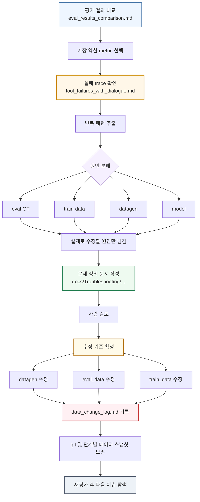
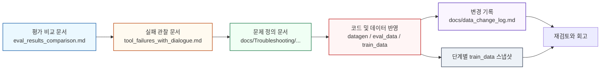
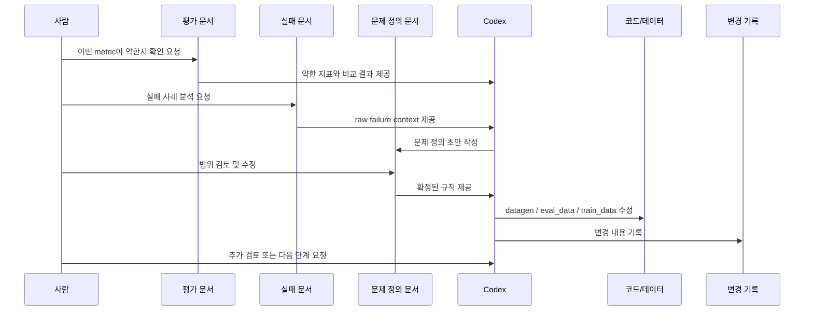

# 하네스 엔지니어링을 도입한 구조화 문제 해결한 방식

작성일: 2026-04-02

## 한 줄 정리

성능 저하를 바로 모델 능력 부족으로 보지 않고, 실패를 `eval`, `train data`, `datagen`, `model` 관점으로 분해한 뒤, 실제로 개입 가능한 원인만 문서화하고 검토한 다음, 그 기준에 따라 코드와 데이터를 수정하는 방식으로 문제를 해결해 왔다.

## 문제를 정의하는 방식

이 방식의 핵심은 `관측된 실패`와 `실제로 수정할 문제`를 분리하는 데 있다.

예를 들어 어떤 metric이 떨어졌다고 해서, 그 전체를 곧바로 하나의 문제로 다루지 않는다.

먼저 아래를 나눠 본다.

- 지금 실제로 관측된 실패는 무엇인가
- 그 실패가 반복 패턴인가
- 그 패턴은 어디에서 만들어졌는가
- 내가 손댈 수 있는 층위는 어디인가

즉 문제 정의는 아래 질문으로 시작한다.

- 이 실패는 eval GT 문제인가
- train data 분포 문제인가
- datagen의 함수 정의 / 슬롯 규칙 / 프롬프트 문제인가
- 아니면 모델이 순수하게 실수한 것인가

이 과정을 거치면 같은 실패라도 모두 같은 종류의 문제로 다루지 않게 된다.

예를 들어:

- `query/category` 혼선은 annotation policy와 datagen 규칙 문제로 본다
- `min_rating`의 soft-to-hard 변환은 datagen 규칙과 dataset 분포 문제로 본다
- `relevance_detection`의 일부 실패는 순수 모델 실수로 제외하고, `get_order_status` 경계 같은 datagen 문제만 남긴다

즉 `이 실패가 어디서부터 왔는지 그 근본을 확인한다`

## 실제로 문제를 풀 때의 흐름

내가 실제로 문제를 다루는 흐름은 아래와 같다.

### 평가 결과표
``` # Eval Results Comparison

`qwen-2.5-7b-base`, `gpt4o`, `qwen-2.5-7b-function-calling_batch2_data_v2`의 최신 평가 결과를 비교한 문서다.

비교 조건은 동일하다.

- total: 430
- tool_call: 194
- non_tool_call: 236
- conversations: 53
- turns: 236

## 실험 개요

| 모델 | 예측 파일 | 결과 파일 |
|---|---|---|
| qwen-2.5-7b-base | `eval_output/qwen-2.5-7b-base/predictions.jsonl` | `eval_output/qwen-2.5-7b-base/eval_results.json` |
| gpt4o | `eval_output_gpt-4o/predictions.jsonl` | `eval_output_gpt-4o/eval_results.json` |
| qwen-2.5-7b-function-calling_batch2_data_v2 | `eval_output/qwen-2.5-7b-function-calling_batch2_data_v2/predictions.jsonl` | `eval_output/qwen-2.5-7b-function-calling_batch2_data_v2/eval_results.json` |

## Tool Call Level

| 지표 | qwen-2.5-7b-base | gpt4o | qwen-2.5-7b-function-calling_batch2_data_v2 |
|---|---:|---:|---:|
| relevance_detection_acc | 88.60% (381/430) | 79.07% (340/430) | 90.23% (388/430) |
| format_compliance_acc | 96.84% (153/158) | 98.10% (103/105) | 95.58% (173/181) |
| function_matching_acc | 90.85% (139/153) | 98.06% (101/103) | 95.95% (166/173) |
| param_hallucination_acc | 100.00% (139/139) | 100.00% (101/101) | 100.00% (166/166) |
| required_params_acc | 100.00% (139/139) | 100.00% (101/101) | 100.00% (166/166) |
| argument_type_acc | 100.00% (139/139) | 100.00% (101/101) | 100.00% (166/166) |
| argument_value_acc | 61.15% (85/139) | 74.26% (75/101) | 75.30% (125/166) |

## Multi-Turn

| 지표 | qwen-2.5-7b-base | gpt4o | qwen-2.5-7b-function-calling_batch2_data_v2 |
|---|---:|---:|---:|
| turn_level_accuracy | 62.71% (148/236) | 61.86% (146/236) | 64.83% (153/236) |
| conversation_success_rate | 22.64% (12/53) | 18.87% (10/53) | 15.09% (8/53) |
| conversation_progress_rate | 65.33% | 62.00% | 63.37% |
| first_failure_turn_avg | 0.54 | 0.30 | 0.36 |
| error_cascade_rate | 38.82% (33/85) | 36.05% (31/86) | 30.86% (25/81) |

```
### 실제 실패 사례 분석(tool_failures_with_dialogue)
``` # Tool Failure Review

- 모델 출력 경로: `eval_output/qwen-2.5-7b-function-calling_batch2_data_v2/predictions.jsonl`
- 전체 tool-level 실패 건수: **98**
- 포함 기준: tool level 평가에서 pass하지 못한 모든 step

## 실패 단계별 건수

- `relevance_detection`: 42건
- `argument_value`: 41건
- `format_compliance`: 8건
- `function_matching`: 7건

## 함수별 건수

- `search_restaurants`: 42건
- `get_order_status`: 18건
- `place_order`: 11건
- `prepare_checkout`: 6건
- `add_to_cart`: 5건
- `get_restaurant_detail`: 4건
- `list_addresses`: 4건
- `upsert_address`: 4건
- `get_cart`: 3건
- `update_cart_item`: 1건

## 1. conv=0 turn=0 step=0 `search_restaurants`

**현재 user 요청**
```text
안녕하세요. 점심 먹으려고요. 지금 영업 중인 한식 맛집 좀 추천해줘요.
```

**실패 단계**: `argument_value`
- value_mismatches: `[{"param": "category", "expected": null, "predicted": "한식"}, {"param": "query", "expected": "한식", "predicted": null}]`

**GT**
```json
{
  "name": "search_restaurants",
  "arguments": {
    "query": "한식",
    "only_open": true
  }
}
```

**PRED**
```json
{
  "name": "search_restaurants",
  "arguments": {
    "query": null,
    "category": "한식",
    "min_rating": null,
    "only_open": true,
    "sort": "rating"
  }
}
```

**정규화 후 GT**
```json
{
  "query": "한식",
  "only_open": true,
  "category": null,
  "min_rating": null,
  "sort": "rating"
}
```

**정규화 후 PRED**
```json
{
  "query": null,
  "category": "한식",
  "min_rating": null,
  "only_open": true,
  "sort": "rating"
}
```

**불일치 키**: `category, query`

- `category`: GT=null / PRED="한식"
- `query`: GT="한식" / PRED=null

---
```



이 흐름에서 중요한 점은, 분석과 반영이 분리된다는 것이다.

- 먼저 문제를 해석하고 문서화한다
- 그다음 문서를 근거로 실제 반영을 한다

즉 나는 `문제 해석 단계`와 `변경 실행 단계`를 의도적으로 분리한다.

## 왜 문서화를 먼저 하는가

나는 metric이 깨졌을 때 바로 코드나 데이터부터 수정하지 않는다.

그 이유는 아래와 같다.

### 1. 실패를 재현 가능한 판단 기준으로 바꿔야 하기 때문이다

실패 사례를 몇 개 본 상태에서 바로 수정하면, 그 순간의 직감으로만 판단하게 된다.

하지만 문서로 정리하면:

- 어떤 사례가 근거였는지
- 어떤 케이스는 제외했는지
- 왜 그 원인을 선택했는지
- 어떤 규칙으로 고칠 것인지

가 남는다.

즉 문서화는 단순 기록이 아니라, 이후에도 다시 꺼내 쓸 수 있는 판단 기준을 만드는 과정이다.

### 2. 순수 모델 실수와 구조 문제를 분리해야 하기 때문이다

모든 실패를 datagen이나 dataset 문제로 보면 과잉 수정이 생긴다.

반대로 모든 실패를 모델 문제로 보면, 실제로 고칠 수 있는 구조 문제를 놓친다.

그래서 나는 문서에서 아래를 분리한다.

- 그냥 모델이 틀린 케이스
- 함수 정의가 애매해서 생긴 케이스
- GT 정책이 흔들려 생긴 케이스
- train data 분포가 나빠서 생긴 케이스

이 분리 작업이 없으면, 수정은 많아지는데 성능은 안 오르는 일이 반복된다.

### 3. 사람 검토를 통해 범위를 고정해야 하기 때문이다

내 프로세스는 완전 자동 수정이 아니다.

분석 문서를 먼저 만들고, 그 문서를 사람과 함께 검토한 뒤, 최종 규칙을 확정한다.

즉 휴먼 인 더 루프는 단순 승인 버튼이 아니라:

- 원인 해석이 과한지
- 실제로 고칠 문제만 남겼는지
- 어떤 케이스를 제외할지
- 데이터에 어떤 기준으로 반영할지

를 검토하는 단계다.

## 문서들이 실제로 맡는 역할

이 repo에서 문서는 단순 메모가 아니라, 다음 작업의 기준점 역할을 한다.



각 문서 계층의 역할은 아래처럼 다르다.

- 평가 비교 문서:
  어떤 metric이 약한지 찾는 출발점
- 실패 관찰 문서:
  실패를 raw trace 수준으로 확인하는 재료
- 문제 정의 문서:
  실패를 규칙, 정책, 설계 문제로 정리하는 기준
- 코드/데이터 반영:
  실제 수정이 일어나는 단계
- 변경 로그와 스냅샷:
  무엇을 왜 바꿨는지 추적하기 위한 기록

이 구조가 있기 때문에, 수정이 한 번의 즉흥적 판단으로 끝나지 않고 다음 작업으로 연결된다.

## 이렇게 구조화한 덕분에 Codex와 더 빨리 해결할 수 있었던 이유

이 구조의 가장 큰 장점 중 하나는, Codex가 해야 할 일을 훨씬 명확하게 받을 수 있었다는 점이다.

문제가 구조화되어 있지 않으면, AI는 매번 아래를 다시 추측해야 한다.

- 지금 진짜 문제는 무엇인지
- 어디까지가 모델 실수인지
- 어디부터가 데이터 수정 대상인지
- 문서를 먼저 써야 하는지, 코드를 먼저 고쳐야 하는지
- 로그를 남겨야 하는지

반대로 지금처럼 구조가 잡혀 있으면, Codex는 단계별로 다음 행동을 훨씬 쉽게 이어갈 수 있다.

- 평가 결과를 보고 가장 약한 metric을 찾는다
- 실패 문서를 보고 반복 패턴을 추린다
- 문제 정의 문서를 작성하거나 수정한다
- 검토받은 기준대로 `datagen`, `eval_data`, `train_data`를 반영한다
- `data_change_log.md`를 업데이트한다
- 필요한 경우 git 단위로 변경을 나눈다

즉 사람이 매번 전체 맥락을 다시 설명하지 않아도, Codex가 문서들을 읽고 현재 단계에 맞는 작업을 수행할 수 있게 된다.

아래는 이 협업 흐름을 간단히 그린 것이다.



이 흐름이 자연스러운 이유는, 사람과 Codex가 서로 역할을 나눠 가질 수 있기 때문이다.

- 사람은 문제의 범위와 정책을 검토한다
- Codex는 문서를 읽고, 수정하고, 반영하고, 기록한다

즉 구조가 잘 잡혀 있을수록, Codex는 단순한 코드 작성 도구가 아니라 `분석 -> 정리 -> 수정 -> 기록`을 따라가는 작업 파트너처럼 움직일 수 있다.

## 실제로 빨라진 이유

이 구조 덕분에 Codex와의 작업 속도가 빨라진 이유는 크게 네 가지다.

### 1. 매번 처음부터 설명하지 않아도 된다

문제 정의 문서와 변경 로그가 있기 때문에, 이미 검토된 기준을 다시 설명하는 시간이 줄어든다.

### 2. 무엇을 고쳐야 하는지가 좁혀진다

문제 정의 단계에서 `모델 실수`와 `실제로 고칠 문제`를 분리해 두었기 때문에, Codex가 불필요한 수정까지 넓게 건드리지 않게 된다.

### 3. 수정 후 무엇을 기록해야 하는지도 명확하다

코드나 데이터를 바꾼 뒤에는 [data_change_log.md](/home/cwj/llm-project/docs/data_change_log.md)에 남긴다는 규칙이 있으므로, 작업 마무리 방식까지 자연스럽게 이어진다.

### 4. 이전 단계와 비교가 가능하다

`train_data`의 단계별 스냅샷 구조가 있기 때문에, 어느 수정이 언제 들어갔는지 비교하고 되돌아보기가 쉽다.

즉 이 구조는 사람의 판단 부담도 줄이고, Codex의 실행 부담도 줄인다.

## 단계별 train_data 스냅샷의 의미

`train_data`에는 변경이 누적될 때마다 이전 단계를 남겨 두는 구조가 있다.

- [origin](/home/cwj/llm-project/train_data/origin/dataset_500.jsonl)
- [1.delete_page](/home/cwj/llm-project/train_data/1.delete_page/dataset_500.jsonl)
- [2.query_category](/home/cwj/llm-project/train_data/2.query_category/dataset_500.jsonl)
- [3.delete_open_sort](/home/cwj/llm-project/train_data/3.delete_open_sort/dataset_500.jsonl)
- [4.min_rating](/home/cwj/llm-project/train_data/4.min_rating/dataset_500.jsonl)
- [5.rel_detec](/home/cwj/llm-project/train_data/5.rel_detec/dataset_500.jsonl)

이 구조는 단순 백업이 아니다.

이건 아래를 가능하게 한다.

- 어떤 수정이 어느 단계에서 들어갔는지 추적
- 특정 이슈 수정 전후를 비교
- regression이 생겼을 때 어느 단계에서 문제가 생겼는지 역추적
- 향후 학습 실험 시 어떤 데이터 버전을 썼는지 기록

즉 내 방식은 변경을 누적하는 것이 아니라, 변경의 계보를 남기는 방식에 가깝다.

## 최종 정리

내가 하는 일은 metric을 보고 에러를 몇 개 고치는 작업으로 끝나지 않는다.

나는 대체로 아래 순서로 문제를 해결한다.

1. 가장 약한 metric을 찾는다.
2. 실패 사례를 raw trace 수준으로 분해한다.
3. 실패를 `eval / train data / datagen / model`로 나눠 본다.
4. 실제로 수정 가능한 원인만 남겨 문제 정의 문서를 만든다.
5. 사람 검토를 통해 수정 기준을 확정한다.
6. 그 기준에 따라 코드와 데이터를 수정한다.
7. 변경 이력을 문서와 스냅샷으로 남긴다.
8. 다시 평가해서 다음 구조 문제를 찾는다.

이렇게 구조화해 두었기 때문에, 사람 혼자 모든 판단과 수정을 다 끌고 가지 않아도 된다.

Codex는 문서를 읽고 현재 단계에 맞는 작업을 수행하고, 사람은 그중에서 범위와 기준을 검토하는 방식으로 훨씬 빠르게 함께 문제를 해결할 수 있었다.
